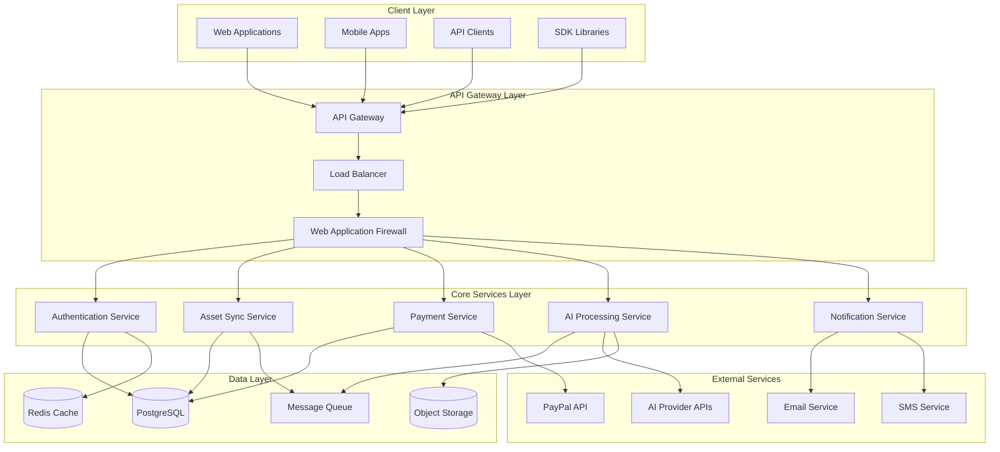
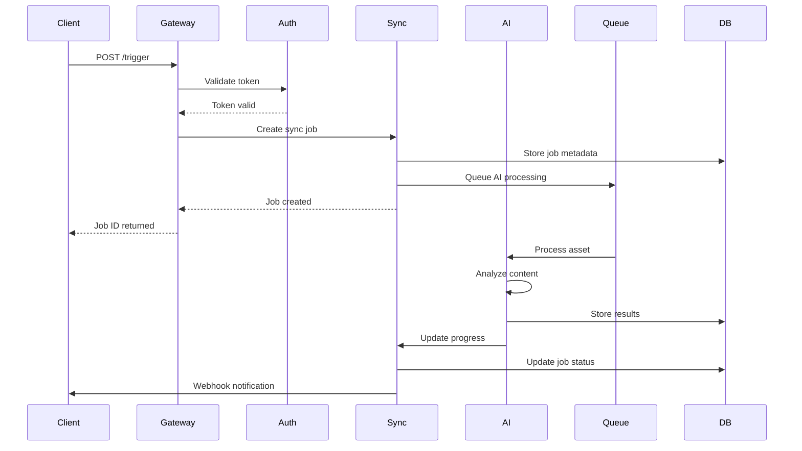
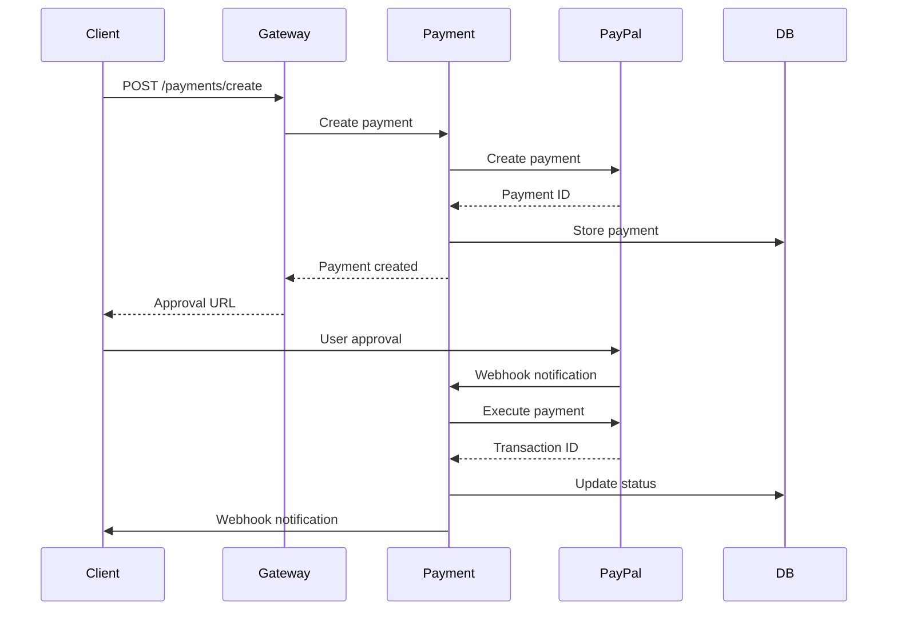

# LEGENDO SYNC - System Architecture Documentation

## Table of Contents

1. [System Overview](#system-overview)
2. [Architecture Principles](#architecture-principles)
3. [High-Level Architecture](#high-level-architecture)
4. [Core Components](#core-components)
5. [Data Flow](#data-flow)
6. [Security Architecture](#security-architecture)
7. [Scalability Design](#scalability-design)
8. [Deployment Architecture](#deployment-architecture)
9. [Monitoring and Observability](#monitoring-and-observability)
10. [API Design Patterns](#api-design-patterns)
11. [Database Design](#database-design)
12. [Integration Patterns](#integration-patterns)
13. [Performance Considerations](#performance-considerations)
14. [Disaster Recovery](#disaster-recovery)

## System Overview

LEGENDO SYNC is a vault-grade AI executor designed for asset synchronization and PayPal payment processing. The system provides a robust, scalable, and secure platform for handling complex asset management operations with real-time processing capabilities.

### Key Characteristics

- **Vault-Grade Security**: Enterprise-level security with encryption, authentication, and audit logging
- **AI-Powered Processing**: Advanced AI algorithms for intelligent asset synchronization
- **Real-Time Processing**: Low-latency operations with real-time status updates
- **High Availability**: 99.9% uptime with fault tolerance and redundancy
- **Scalable Architecture**: Horizontal scaling capabilities to handle growing workloads
- **Multi-Tenant Support**: Secure isolation for multiple clients and organizations

## Architecture Principles

### 1. Microservices Architecture
- **Service Independence**: Each service can be developed, deployed, and scaled independently
- **API-First Design**: All services communicate through well-defined REST APIs
- **Database per Service**: Each service owns its data and database
- **Fault Isolation**: Failures in one service don't cascade to others

### 2. Event-Driven Architecture
- **Asynchronous Processing**: Non-blocking operations for better performance
- **Event Sourcing**: All state changes are captured as events
- **CQRS Pattern**: Separate read and write models for optimal performance
- **Eventual Consistency**: System maintains consistency over time

### 3. Security by Design
- **Zero Trust Model**: No implicit trust, verify everything
- **Defense in Depth**: Multiple layers of security controls
- **Principle of Least Privilege**: Minimal access rights for all components
- **Encryption Everywhere**: Data encrypted in transit and at rest

### 4. Cloud-Native Design
- **Containerization**: All services run in containers
- **Orchestration**: Kubernetes for container orchestration
- **Auto-Scaling**: Dynamic scaling based on demand
- **Infrastructure as Code**: All infrastructure defined as code

## High-Level Architecture



## Core Components

### 1. API Gateway

**Purpose**: Single entry point for all client requests

**Responsibilities**:
- Request routing and load balancing
- Authentication and authorization
- Rate limiting and throttling
- Request/response transformation
- API versioning
- CORS handling

**Technology Stack**:
- Kong or AWS API Gateway
- Nginx for load balancing
- Redis for rate limiting

**Key Features**:
- JWT token validation
- API key management
- Request/response logging
- Circuit breaker pattern
- Health check endpoints

### 2. Authentication Service

**Purpose**: Centralized authentication and authorization

**Responsibilities**:
- User authentication (JWT tokens)
- API key management
- Role-based access control (RBAC)
- Session management
- Multi-factor authentication (MFA)

**Technology Stack**:
- Node.js with Express
- JWT for token management
- bcrypt for password hashing
- Redis for session storage

**Key Features**:
- OAuth 2.0 / OpenID Connect
- Social login integration
- Password reset flows
- Account lockout protection
- Audit logging

### 3. Asset Sync Service

**Purpose**: Core business logic for asset synchronization

**Responsibilities**:
- Asset discovery and cataloging
- Sync job management
- Progress tracking
- Error handling and retry logic
- Webhook notifications

**Technology Stack**:
- Node.js with Express
- PostgreSQL for job storage
- Redis for caching
- Bull Queue for job processing

**Key Features**:
- Incremental and full sync modes
- Priority-based job queuing
- Real-time progress updates
- Batch processing
- Resume capability

### 4. AI Processing Service

**Purpose**: AI-powered asset analysis and processing

**Responsibilities**:
- Asset content analysis
- Intelligent categorization
- Duplicate detection
- Quality assessment
- Metadata extraction

**Technology Stack**:
- Python with FastAPI
- TensorFlow/PyTorch for ML models
- Celery for task processing
- Redis for task queue

**Key Features**:
- Custom AI models
- Batch processing
- Model versioning
- A/B testing support
- Performance monitoring

### 5. Payment Service

**Purpose**: PayPal payment processing and management

**Responsibilities**:
- Payment creation and execution
- Transaction management
- Refund processing
- Webhook handling
- Financial reporting

**Technology Stack**:
- Node.js with Express
- PayPal REST SDK
- PostgreSQL for transaction storage
- Redis for caching

**Key Features**:
- Multiple payment methods
- Subscription billing
- Invoice generation
- Tax calculation
- Fraud detection

### 6. Notification Service

**Purpose**: Multi-channel notification delivery

**Responsibilities**:
- Email notifications
- SMS notifications
- Push notifications
- Webhook delivery
- Notification templates

**Technology Stack**:
- Node.js with Express
- SendGrid for email
- Twilio for SMS
- Firebase for push notifications

**Key Features**:
- Template management
- Delivery tracking
- Retry logic
- Unsubscribe handling
- A/B testing

## Data Flow

### 1. Asset Sync Flow



### 2. Payment Processing Flow



## Security Architecture

### 1. Network Security

**Perimeter Security**:
- Web Application Firewall (WAF)
- DDoS protection
- IP whitelisting
- VPN access for admin functions

**Network Segmentation**:
- Public subnet for load balancers
- Private subnet for application services
- Database subnet for data stores
- Management subnet for monitoring

### 2. Application Security

**Authentication**:
- Multi-factor authentication (MFA)
- OAuth 2.0 / OpenID Connect
- JWT tokens with short expiration
- API key authentication

**Authorization**:
- Role-based access control (RBAC)
- Attribute-based access control (ABAC)
- Resource-level permissions
- API endpoint protection

**Data Protection**:
- Encryption in transit (TLS 1.3)
- Encryption at rest (AES-256)
- Key management (AWS KMS)
- Data masking for logs

### 3. Infrastructure Security

**Container Security**:
- Base image scanning
- Runtime security monitoring
- Non-root containers
- Resource limits

**Secrets Management**:
- HashiCorp Vault or AWS Secrets Manager
- Automatic secret rotation
- Encrypted storage
- Access logging

## Scalability Design

### 1. Horizontal Scaling

**Stateless Services**:
- All services designed to be stateless
- Session data stored in Redis
- Load balancer distribution
- Auto-scaling groups

**Database Scaling**:
- Read replicas for read operations
- Sharding for large datasets
- Connection pooling
- Query optimization

### 2. Caching Strategy

**Multi-Level Caching**:
- CDN for static content
- Redis for application cache
- Database query cache
- Browser caching

**Cache Invalidation**:
- TTL-based expiration
- Event-driven invalidation
- Cache warming strategies
- Cache consistency

### 3. Queue Management

**Message Queues**:
- Redis for simple queues
- Apache Kafka for high-throughput
- Dead letter queues
- Message persistence

**Job Processing**:
- Worker auto-scaling
- Priority queues
- Batch processing
- Retry mechanisms

## Deployment Architecture

### 1. Container Orchestration

**Kubernetes Cluster**:
- Master nodes for control plane
- Worker nodes for workloads
- etcd for cluster state
- CNI for networking

**Service Mesh**:
- Istio for service communication
- Traffic management
- Security policies
- Observability

### 2. CI/CD Pipeline

**Source Control**:
- Git repositories
- Branch protection rules
- Code review requirements
- Automated testing

**Build Pipeline**:
- Docker image building
- Security scanning
- Unit and integration tests
- Artifact storage

**Deployment**:
- Blue-green deployments
- Canary releases
- Rollback capabilities
- Health checks

### 3. Infrastructure as Code

**Terraform**:
- Infrastructure provisioning
- Environment management
- State management
- Resource tagging

**Helm Charts**:
- Kubernetes deployments
- Configuration management
- Version control
- Rollback support

## Monitoring and Observability

### 1. Logging

**Centralized Logging**:
- ELK Stack (Elasticsearch, Logstash, Kibana)
- Structured logging (JSON)
- Log aggregation
- Log retention policies

**Log Levels**:
- ERROR: System errors
- WARN: Warning conditions
- INFO: General information
- DEBUG: Detailed debugging

### 2. Metrics

**Application Metrics**:
- Request rates and latencies
- Error rates
- Business metrics
- Custom metrics

**Infrastructure Metrics**:
- CPU and memory usage
- Network traffic
- Disk I/O
- Database performance

**Monitoring Tools**:
- Prometheus for metrics collection
- Grafana for visualization
- AlertManager for notifications
- Custom dashboards

### 3. Tracing

**Distributed Tracing**:
- OpenTelemetry for instrumentation
- Jaeger for trace visualization
- Request correlation
- Performance analysis

**Trace Sampling**:
- Head-based sampling
- Tail-based sampling
- Adaptive sampling
- Cost optimization

## API Design Patterns

### 1. RESTful Design

**Resource-Based URLs**:
```
GET    /api/v1/sync/jobs
POST   /api/v1/sync/jobs
GET    /api/v1/sync/jobs/{id}
PUT    /api/v1/sync/jobs/{id}
DELETE /api/v1/sync/jobs/{id}
```

**HTTP Status Codes**:
- 200: Success
- 201: Created
- 400: Bad Request
- 401: Unauthorized
- 403: Forbidden
- 404: Not Found
- 429: Too Many Requests
- 500: Internal Server Error

### 2. Pagination

**Cursor-Based Pagination**:
```json
{
  "data": [...],
  "pagination": {
    "cursor": "eyJpZCI6MTIzfQ==",
    "hasNext": true,
    "hasPrev": false
  }
}
```

### 3. Filtering and Sorting

**Query Parameters**:
```
GET /api/v1/sync/jobs?status=completed&sort=created_at&order=desc&limit=50
```

### 4. Versioning

**URL Versioning**:
```
/api/v1/sync/jobs
/api/v2/sync/jobs
```

**Header Versioning**:
```
Accept: application/vnd.legendo.v1+json
```

## Database Design

### 1. Database Schema

**Users Table**:
```sql
CREATE TABLE users (
    id UUID PRIMARY KEY DEFAULT gen_random_uuid(),
    email VARCHAR(255) UNIQUE NOT NULL,
    password_hash VARCHAR(255) NOT NULL,
    first_name VARCHAR(100),
    last_name VARCHAR(100),
    created_at TIMESTAMP DEFAULT NOW(),
    updated_at TIMESTAMP DEFAULT NOW(),
    last_login_at TIMESTAMP,
    is_active BOOLEAN DEFAULT true
);
```

**Sync Jobs Table**:
```sql
CREATE TABLE sync_jobs (
    id UUID PRIMARY KEY DEFAULT gen_random_uuid(),
    user_id UUID REFERENCES users(id),
    input TEXT NOT NULL,
    status VARCHAR(50) NOT NULL,
    progress INTEGER DEFAULT 0,
    options JSONB,
    result JSONB,
    error_message TEXT,
    created_at TIMESTAMP DEFAULT NOW(),
    started_at TIMESTAMP,
    completed_at TIMESTAMP
);
```

**Payments Table**:
```sql
CREATE TABLE payments (
    id UUID PRIMARY KEY DEFAULT gen_random_uuid(),
    user_id UUID REFERENCES users(id),
    paypal_payment_id VARCHAR(255) UNIQUE,
    amount DECIMAL(10,2) NOT NULL,
    currency VARCHAR(3) NOT NULL,
    status VARCHAR(50) NOT NULL,
    description TEXT,
    created_at TIMESTAMP DEFAULT NOW(),
    executed_at TIMESTAMP
);
```

### 2. Indexing Strategy

**Primary Indexes**:
- Primary keys (clustered)
- Foreign keys
- Unique constraints

**Secondary Indexes**:
- Status fields for filtering
- Created_at for sorting
- User_id for user queries
- Composite indexes for complex queries

### 3. Data Partitioning

**Time-Based Partitioning**:
- Partition by month for logs
- Automatic partition creation
- Old partition archival
- Query optimization

## Integration Patterns

### 1. Synchronous Integration

**REST APIs**:
- HTTP/HTTPS communication
- JSON payload format
- Standard status codes
- Error handling

**GraphQL**:
- Single endpoint
- Flexible queries
- Real-time subscriptions
- Schema validation

### 2. Asynchronous Integration

**Message Queues**:
- Event publishing
- Event consumption
- Dead letter handling
- Message ordering

**Webhooks**:
- HTTP callbacks
- Retry mechanisms
- Signature verification
- Idempotency

### 3. Batch Integration

**File Transfer**:
- SFTP/FTPS
- S3 integration
- File validation
- Processing status

**API Batching**:
- Bulk operations
- Batch responses
- Error handling
- Progress tracking

## Performance Considerations

### 1. Response Time Optimization

**Database Optimization**:
- Query optimization
- Index tuning
- Connection pooling
- Read replicas

**Caching Strategy**:
- Application-level caching
- Database query caching
- CDN for static content
- Browser caching

### 2. Throughput Optimization

**Horizontal Scaling**:
- Load balancing
- Auto-scaling
- Stateless design
- Queue processing

**Resource Optimization**:
- Memory management
- CPU optimization
- I/O optimization
- Network optimization

### 3. Latency Reduction

**Geographic Distribution**:
- Multi-region deployment
- CDN distribution
- Edge computing
- Data locality

**Connection Optimization**:
- HTTP/2 support
- Connection pooling
- Keep-alive connections
- Compression

## Disaster Recovery

### 1. Backup Strategy

**Database Backups**:
- Daily full backups
- Continuous WAL archiving
- Point-in-time recovery
- Cross-region replication

**Application Backups**:
- Configuration backups
- Code repository backups
- Container image backups
- Infrastructure state backups

### 2. Recovery Procedures

**RTO/RPO Targets**:
- RTO: 4 hours
- RPO: 1 hour
- Automated failover
- Manual recovery procedures

**Testing**:
- Regular DR drills
- Recovery testing
- Documentation updates
- Team training

### 3. High Availability

**Multi-AZ Deployment**:
- Availability zone distribution
- Cross-AZ replication
- Automatic failover
- Health monitoring

**Redundancy**:
- Multiple instances
- Load balancer redundancy
- Database clustering
- Network redundancy

## Technology Stack Summary

### Backend Services
- **Runtime**: Node.js 18+
- **Framework**: Express.js
- **Language**: JavaScript/TypeScript
- **AI Processing**: Python 3.9+

### Databases
- **Primary**: PostgreSQL 14+
- **Cache**: Redis 6+
- **Object Storage**: AWS S3
- **Search**: Elasticsearch 8+

### Infrastructure
- **Containerization**: Docker
- **Orchestration**: Kubernetes
- **Service Mesh**: Istio
- **API Gateway**: Kong

### Monitoring
- **Metrics**: Prometheus + Grafana
- **Logging**: ELK Stack
- **Tracing**: Jaeger
- **Alerting**: AlertManager

### Security
- **Secrets**: HashiCorp Vault
- **Encryption**: AWS KMS
- **WAF**: CloudFlare
- **SSL**: Let's Encrypt

This architecture documentation provides a comprehensive overview of the LEGENDO SYNC system design, covering all aspects from high-level architecture to implementation details. The system is designed to be scalable, secure, and maintainable while providing excellent performance and reliability.